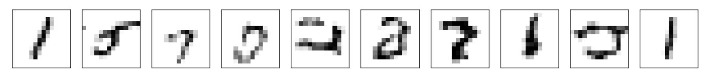

# Generative models with tensorflow version 2.0 style
* All right reserved @ Il Gu Yi, Soochul Park

This repository is a collection of various generative models (Normalizing flow, Autoregressive models)
implemented by TensorFlow version 2.0 style

## Getting Started

### Prerequisites
* [`TensorFlow`](https://www.tensorflow.org) 2.0
* Python 3.6
* Python libraries:
  * `numpy`, `matplotlib`, `PIL`, `imageio`
  * `urllib`, `zipfile`
* TensorFlow libraries & extensions:
  * [`tensorflow_probability`](https://www.tensorflow.org/probability/)
* Jupyter notebook
* OS X and Linux (Not validated on Windows OS)

## Contents

### AutoRegressive Models [with MNIST]

#### Fully Visible Sigmoid Belief Networks
* [fvsbn.ipynb](https://nbviewer.jupyter.org/github/ilguyi/generative.models.tensorflow.v2/blob/master/autoregressive/fvsbn.ipynb)

| *MNIST* | *Fashion MNIST* |
|---|---|
|  |  |

#### LSTM with MNIST
* [lstm_mnist.ipynb](https://nbviewer.jupyter.org/github/scpark20/generative.models.tensorflow.v2/blob/master/autoregressive/lstm_mnist.ipynb)

| *MNIST* |
|---|
|  |

#### Transformer with MNIST
* Attention is All You Need [arXiv:1706.03762](https://arxiv.org/abs/1706.03762)
* [transformer_mnist.ipynb](https://nbviewer.jupyter.org/github/scpark20/generative.models.tensorflow.v2/blob/master/autoregressive/transformer_mnist.ipynb)

| *MNIST* |
|---|
|  |

### Normalizing Flow Models [with MNIST]

#### NICE: Non-Linear Independent Components Estimation
* [nice.ipynb](https://nbviewer.jupyter.org/github/ilguyi/generative.models.tensorflow.v2/blob/master/normalizing_flow/nice.ipynb)

## Author
Il Gu Yi, Soochul Park

### Slides
[Notion link](https://www.notion.so/soochul/Generative-Models-12-4-6-353a0bbc5e0847fab4c864fb4332d9af?showMoveTo=true)
